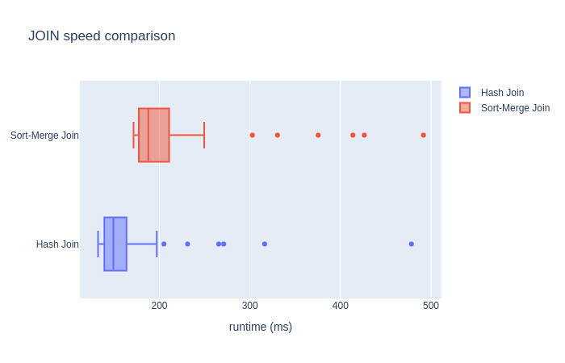

# Mini query runner

A python implementation of JOIN, ORDERBY, COUNTBY, TAKE, SELECT and FROM that runs against .csv files. To highlight: 
- JOIN: offers inner join using [Hash Join](https://en.wikipedia.org/wiki/Hash_join#Classic_hash_join) and [Sort-Merge Join](https://www.youtube.com/watch?v=jiWCPJtDE2c). See speed comparison at the end.
- COUNTBY: equivalent to `COUNT(*) ... GROUPBY <col>`, appends column `count`.

## Run

```python
python3 query_runner.py
```
starts an interactive shell where you can type in your query. The query should be a single line. Hit enter to print records retrieved.

## Query Syntax

Query should start with `FROM` followed by path to a .csv file. The query keywords and be mix-and-matched.

### JOIN
```
FROM <path_to_csv_1> JOIN <path_to_csv_2> <join_column>
```
where `join_column` is a common column in both files. Multiple joins are supported. The order of columns are maintained based on the order of files.

#### SELECT
```
FROM <path_to_csv> SELECT <col_1>,<col_2>,...<col_n>
```
same as SQL SELECT.

#### COUNTBY
```
FROM <path_to_csv> COUNTBY <column>
```
groups data by column specified and count rows within each group.

#### ORDERBY
```
FROM <path_to_csv> ORDERBY <numerical_column>
```
sorts rows by column specified. 

#### TAKE

```
FROM <path_to_csv> TAKE <num_rows>
```
returns top `n` rows.

## Examples

Data in `./data` from [Pokemon - Weedle's Cave](https://www.kaggle.com/terminus7/pokemon-challenge?select=pokemon.csv).


### 1. Multiple JOINs
```
FROM ./data/pokemon.csv JOIN ./data/stats.csv id JOIN ./data/legendary.csv id TAKE 3
```
Output:
```
id,name,type1,type2,hp,attack,defense,special_attack,special_defence,speed,generation,is_legendary
1,Bulbasaur,Grass,Poison,45,49,49,65,65,45,1,False
2,Ivysaur,Grass,Poison,60,62,63,80,80,60,1,False
3,Venusaur,Grass,Poison,80,82,83,100,100,80,1,False
```

### 2. COUNTBY, ORDERBY, TAKE 
```
FROM ./data/pokemon.csv COUNTBY type1 ORDERBY count TAKE 5
```
Output:
```
type1,count
Water,112
Normal,98
Grass,70
Bug,69
Psychic,57
```


## Speed of Hash Join and Sort-Merge Join

Data - two randomly generated datasets:
- `dummy_1`: 30000 rows, 4 columns
- `dummy_2`: 20000 rows, 3 columns
- `index` column is randomly ordered

Below query is run 50 times for each algorithm:
```
FROM ./data/dummy_1.csv JOIN ./data/dummy_2.csv index
```

On average, hash join took 167.6 ms to complete the query, with an standard deviation of 57.6 ms. Sort merge join took 215.67 ms, with an standard deviation of 70.1 ms. A Mann Whitney U test shows this difference in speed is statistically significant.


